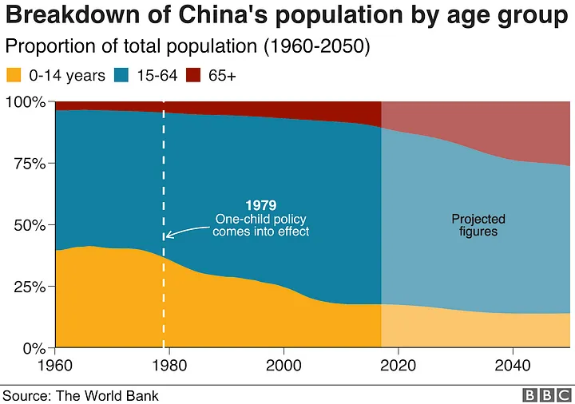
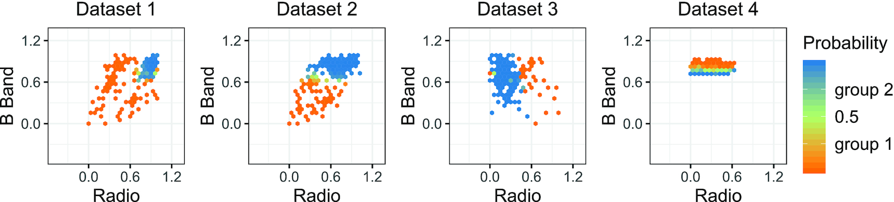
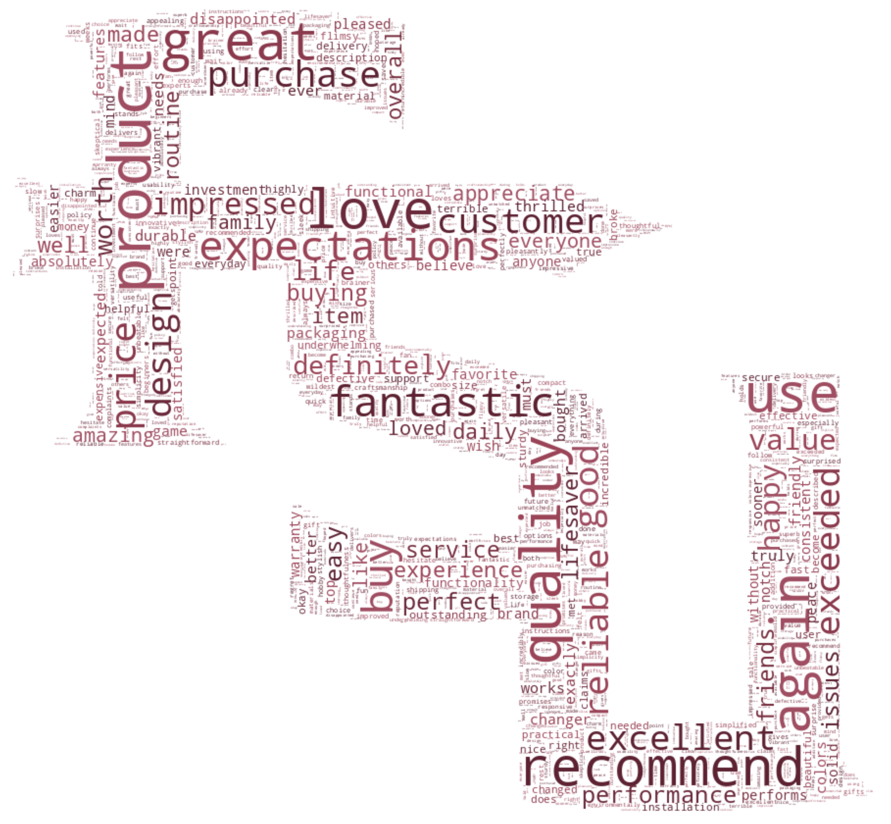
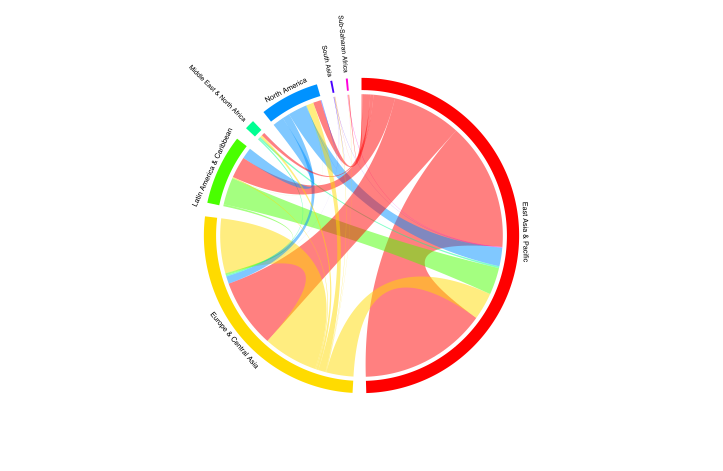

```{r setup}
# options(htmltools.preserve.raw = FALSE)
```

## [Objectives]{style="color:#C2DB70"} {.center .text-slide}

::: {.incremental}
- Provide some insights on data visualization

- Showcase interactive and effective graphs

- Debunk some myths about data visualization
:::

## What is the right way of doing data visualization? {.inverse .center}

## <code><span style="color:#4C5455">It depends...</span></code>

```{r, fig.width=10, fig.height=6, dpi=150}
library(ggplot2)

blu  <- "#2166AC"
grn  <- "#1B7A3E"
hi_b <- "#DAEEFF"
hi_g <- "#D5EEE0"
pnl  <- "#F6F8FB"
brd  <- "#D0D5DE"
txD  <- "#1C1C2E"
txM  <- "#5A6070"
txL  <- "#9AA0AD"

item_rect <- function(x1, x2, y1, y2, highlight, col) {
  bg  <- if (highlight) ifelse(col == blu, hi_b, hi_g) else "white"
  bc  <- if (highlight) col else brd
  lwd <- if (highlight) 0.45 else 0.35
  list(
    r = annotate("rect", xmin = x1, xmax = x2, ymin = y1, ymax = y2,
                 fill = bg, color = bc, linewidth = lwd),
    a = if (highlight)
          annotate("segment", x = x1, xend = x1, y = y1, yend = y2,
                   color = col, linewidth = 2.6)
        else NULL
  )
}

lx1 <- 0.34;  lx2 <- 3.16
rx1 <- 6.84;  rx2 <- 9.66

L1 <- item_rect(lx1, lx2, 6.88, 7.78, TRUE,  grn)
L2 <- item_rect(lx1, lx2, 5.80, 6.70, FALSE, grn)
L3 <- item_rect(lx1, lx2, 4.72, 5.62, TRUE,  grn)

R1 <- item_rect(rx1, rx2, 9.22, 10.12, TRUE,  blu)
R2 <- item_rect(rx1, rx2, 8.14,  9.04, FALSE, blu)
R3 <- item_rect(rx1, rx2, 7.06,  7.96, TRUE,  blu)

ggplot() +
  theme_void(base_family = "sans") +
  theme(
    plot.background = element_rect(fill = "white", color = NA),
    plot.margin     = margin(24, 24, 24, 24)
  ) +
  coord_cartesian(xlim = c(0, 10), ylim = c(2.8, 11.2), expand = FALSE) +

  annotate("rect", xmin = .20, xmax = 3.30, ymin = 4.50, ymax = 8.70,
           fill = pnl, color = grn, linewidth = .55) +
  annotate("rect", xmin = .20, xmax = 3.30, ymin = 8.20, ymax = 8.70,
           fill = grn, color = NA) +
  annotate("text", x = 1.75, y = 8.45, label = "GOALS",
           color = "white", fontface = "bold", size = 4.4, hjust = .5) +
  annotate("text", x = .44, y = 8.00, label = "PURPOSE",
           color = grn, size = 2.9, hjust = 0, fontface = "bold") +

  L1$r + L1$a +
  annotate("text", x = .62, y = 7.51, label = "inform",
           color = grn, fontface = "bold", size = 4.4, hjust = 0) +
  annotate("text", x = .62, y = 7.16, label = "communicate facts & data clearly",
           color = txM, size = 2.8, hjust = 0) +

  L2$r + L2$a +
  annotate("text", x = .62, y = 6.43, label = "impact / convince",
           color = txD, size = 4.4, hjust = 0) +
  annotate("text", x = .62, y = 6.08, label = "persuade and drive decisions",
           color = txM, size = 2.8, hjust = 0) +

  L3$r + L3$a +
  annotate("text", x = .62, y = 5.35, label = "explore / communicate",
           color = grn, fontface = "bold", size = 4.4, hjust = 0) +
  annotate("text", x = .62, y = 5.00, label = "discover patterns & share insights",
           color = txM, size = 2.8, hjust = 0) +

  annotate("rect", xmin = 3.70, xmax = 6.30, ymin = 9.90, ymax = 10.80,
           fill = blu, color = NA) +
  annotate("text", x = 5.00, y = 10.35, label = "AUDIENCE",
           color = "white", fontface = "bold", size = 5.8, hjust = .5) +

  annotate("segment",
           x = 5.00, xend = 5.00, y = 9.90, yend = 8.35,
           arrow     = arrow(length = unit(.22, "cm"), type = "closed"),
           color     = txD,
           linewidth = .90) +

  annotate("rect", xmin = 3.70, xmax = 6.30, ymin = 7.35, ymax = 8.25,
           fill = grn, color = NA) +
  annotate("text", x = 5.00, y = 7.80, label = "GOALS",
           color = "white", fontface = "bold", size = 5.8, hjust = .5) +

  annotate("segment",
           x = 3.70, xend = 3.30, y = 7.80, yend = 7.80,
           linetype = "dashed", color = grn, linewidth = .75) +
  annotate("segment",
           x = 6.30, xend = 6.70, y = 10.35, yend = 10.35,
           linetype = "dashed", color = blu, linewidth = .75) +

  annotate("rect", xmin = 6.70, xmax = 9.80, ymin = 6.80, ymax = 11.00,
           fill = pnl, color = blu, linewidth = .55) +
  annotate("rect", xmin = 6.70, xmax = 9.80, ymin = 10.50, ymax = 11.00,
           fill = blu, color = NA) +
  annotate("text", x = 8.25, y = 10.75, label = "AUDIENCE",
           color = "white", fontface = "bold", size = 4.4, hjust = .5) +
  annotate("text", x = 6.94, y = 10.30, label = "DIMENSIONS",
           color = blu, size = 2.9, hjust = 0, fontface = "bold") +

  R1$r + R1$a +
  annotate("text", x = 7.08, y = 9.85, label = "internal / external",
           color = blu, fontface = "bold", size = 4.4, hjust = 0) +
  annotate("text", x = 7.08, y = 9.50, label = "stakeholders vs. public audience",
           color = txM, size = 2.8, hjust = 0) +

  R2$r + R2$a +
  annotate("text", x = 7.08, y = 8.77, label = "technical / lay",
           color = txD, size = 4.4, hjust = 0) +
  annotate("text", x = 7.08, y = 8.42, label = "expertise level of the reader",
           color = txM, size = 2.8, hjust = 0) +

  R3$r + R3$a +
  annotate("text", x = 7.08, y = 7.69, label = "familiar / unfamiliar",
           color = blu, fontface = "bold", size = 4.4, hjust = 0) +
  annotate("text", x = 7.08, y = 7.34, label = "prior context with the topic",
           color = txM, size = 2.8, hjust = 0) +

  NULL
```

---

:::: {.columns}
::: {.column width="50%"}

<br><br>

- Journalistic



:::
::: {.column width="50%"}

<br><br>

- Scientific

<br><br><br>



Figure1: Probability of each source belonging to a specific group

:::
::::

## <code><span style="color:#4C5455">Data Visualization - the Big Picture</span></code> {.text-slide}

### A broad picture of data visualization

::: {.incremental}
- What is the audience?
- What is the goal?
- What are the effective ways of achieving that goal?
- What are the available tools?
:::

## Design Principles {.center .text-slide}

:::: {.columns}
::: {.column width="50%"}

balance

**emphasis on key areas**

proportion

**smart use of patterns**

:::
::: {.column width="50%"}

**illustrating movement**

**variety (novelty)**

theme (standard)

:::
::::

## <code><span style="color:#4C5455">Case 1 - Gapminder</span></code>

<div style="text-align:center">
<iframe width="660" height="415" src="https://www.youtube.com/embed/hVimVzgtD6w?si=W2hkh8Ax4mtEuIfJ&amp;start=260" title="YouTube video player" frameborder="0" allow="accelerometer; autoplay; clipboard-write; encrypted-media; gyroscope; picture-in-picture; web-share" referrerpolicy="strict-origin-when-cross-origin" allowfullscreen></iframe>
</div>

## <code><span style="color:#4C5455">Case 1 - Gapminder</span></code>

:::: {.columns}
::: {.column width="50%"}

```{r, fig.height=6, fig.width=8}
library(ggplot2)
library(plotly)
library(gapminder)

base <- gapminder %>%
  plot_ly(x = ~gdpPercap, y = ~lifeExp, size = ~pop,
          text = ~country, hoverinfo = "text") %>%
  layout(xaxis = list(type = "log"))

base %>%
  add_markers(color = ~continent, frame = ~year, ids = ~country) %>%
  animation_opts(1000, redraw = FALSE) %>%
  animation_button(
    x = 1, xanchor = "right", y = 0, yanchor = "bottom"
  ) %>%
  animation_slider(
    currentvalue = list(prefix = "YEAR ", font = list(color = "red"))
  )
```

:::
::: {.column width="50%"}

```{r, fig.height=6}
library(ggplot2)
library(gapminder)
library(dplyr)

p <- ggplot(gapminder, aes(x = gdpPercap, y = lifeExp, color = continent)) +
  geom_point(aes(size = pop), alpha = 0.7) +
  scale_x_log10() +
  labs(x = "GDP per capita", y = "Life expectancy",
       title = "Gapminder Data Facetted by Year") +
  facet_wrap(~ year) +
  scale_size(guide = 'none') +
  theme_minimal() +
  theme(legend.position = "bottom")

print(p)
```

:::
::::

## <code><span style="color:#4C5455">Case 2 - Hidden Patterns</span></code>

:::: {.columns}
::: {.column width="50%"}

```{r}
library(plotly)

n_sphere <- 50
theta <- seq(0, 2 * pi, length.out = n_sphere)
phi <- seq(0, pi, length.out = n_sphere)

noise_sphere <- runif(n_sphere * n_sphere, min = -0.1, max = 0.1)
x_sphere <- (1 + noise_sphere) * outer(cos(theta), sin(phi))
y_sphere <- (1 + noise_sphere) * outer(sin(theta), sin(phi))
z_sphere <- outer(rep(1, n_sphere), cos(phi))

noise_sphere_small <- runif(n_sphere * n_sphere, min = -0.05, max = 0.05)
x_sphere_small <- (0.5 + noise_sphere_small) * outer(cos(theta), sin(phi))
y_sphere_small <- (0.5 + noise_sphere_small) * outer(sin(theta), sin(phi))
z_sphere_small <- outer(rep(2, n_sphere), cos(phi))

circle_radius <- 1.5
circle_theta <- seq(0, 2 * pi, length.out = 100)

p <- plot_ly() %>%
  add_markers(x = as.vector(x_sphere), y = as.vector(y_sphere), z = as.vector(z_sphere),
              marker = list(size = 3, color = 'red', opacity = 0.8), name = "Large Sphere") %>%
  add_markers(x = as.vector(x_sphere_small), y = as.vector(y_sphere_small), z = as.vector(z_sphere_small),
              marker = list(size = 3, color = 'red', opacity = 0.8), name = "Small Sphere")

ring_counts <- 5
for (i in 1:ring_counts) {
  radius <- circle_radius + i * 0.2
  z_offset <- i * 0.3
  noise_circle <- runif(length(circle_theta), min = -0.1, max = 0.1)
  x_ring <- (radius + noise_circle) * cos(circle_theta)
  y_ring <- (radius + noise_circle) * sin(circle_theta)
  z_ring <- rep(z_offset, length(circle_theta))
  p <- p %>%
    add_markers(x = x_ring, y = y_ring, z = z_ring,
                marker = list(size = 5, color = 'red', opacity = 0.6),
                name = paste("Ring", i))
}

p <- p %>%
  layout(scene = list(xaxis = list(title = "X"),
                      yaxis = list(title = "Y"),
                      zaxis = list(title = "Z"),
                      camera = list(eye = list(x = 0.8, y = 0.8, z = 3))))
p
```

:::
::: {.column width="50%"}

```{r, fig.height=6}
library(ggplot2)

sphere_data <- data.frame(
  x = as.vector(x_sphere),
  y = as.vector(y_sphere),
  type = "Large Sphere"
)

small_sphere_data <- data.frame(
  x = as.vector(x_sphere_small),
  y = as.vector(y_sphere_small),
  type = "Small Sphere"
)

ring_data <- data.frame()
for (i in 1:ring_counts) {
  radius <- circle_radius + i * 0.2
  noise_circle <- runif(length(circle_theta), min = -0.1, max = 0.1)
  x_ring <- (radius + noise_circle) * cos(circle_theta)
  y_ring <- (radius + noise_circle) * sin(circle_theta)
  ring_data <- rbind(ring_data,
                     data.frame(x = x_ring, y = y_ring, type = paste("Ring", i)))
}

all_data <- rbind(sphere_data, small_sphere_data, ring_data)

p2d <- ggplot(all_data, aes(x = x, y = y)) +
  geom_point(size = 1, alpha = 0.8) +
  labs(title = "2D Projection of Sphere and Rings", x = "X", y = "Y") +
  theme_minimal()

p2d
```

:::
::::

## <code><span style="color:#4C5455">Case 2 - Hidden Patterns (2)</span></code>

:::: {.columns}
::: {.column width="50%"}

```{r, fig.height=6}
library(plotly)
library(dplyr)

set.seed(42)
n <- 100
data <- data.frame(
  Product = rep(LETTERS[1:5], each = n / 5),
  Price = runif(n, 100, 300),
  Sales = runif(n, 20, 150),
  Region = sample(c("North", "South", "East", "West", "Central"), n, replace = TRUE)
)

data <- data %>%
  mutate(Z = case_when(
    Region == "North"   ~ (Price + 6 * Sales^2) / 10000,
    Region == "South"   ~ (Price + 2.3 * Sales^2) / 10000,
    Region == "East"    ~ (Price * 1.2 + Sales * 1.5) / 10000,
    Region == "West"    ~ (Price * 1.5 + Sales * 2) / 10000,
    Region == "Central" ~ (Price + 4 * Sales^2) / 10000
  ))

p3d <- plot_ly(data, x = ~Price, y = ~Sales, z = ~Z,
               color = ~Region,
               colors = c("yellow", "blue", "green", "orange", "purple"),
               text = ~Region,
               marker = list(size = 5, opacity = 0.6)) %>%
  layout(scene = list(xaxis = list(title = "Price (US$/unit)"),
                      yaxis = list(title = "Sales (1K)"),
                      zaxis = list(title = "Discount (US$/unit)")),
         title = "3D Scatter Plot of Sales Data with Distinct Regions")

p3d
```

:::
::: {.column width="50%"}

```{r, fig.height=6}
library(ggplot2)
library(patchwork)

p2d <- ggplot(data, aes(x = Sales, y = Price, color = Region)) +
  geom_point(size = 3, alpha = 0.6) +
  labs(title = "2D Scatter Plot of Sales Data",
       x = "Sales (1K units)", y = "Price (US$/unit)") +
  scale_color_manual(values = c("yellow", "blue", "green", "orange", "purple")) +
  theme_minimal()

p2d2 <- ggplot(data, aes(x = Sales, y = Z, color = Region)) +
  geom_point(size = 3, alpha = 0.6) +
  labs(title = "2D Scatter Plot of Sales Data",
       x = "Sales (1K units)", y = "Discount (US$/unit)") +
  scale_color_manual(values = c("yellow", "blue", "green", "orange", "purple")) +
  theme_minimal()

p2d / p2d2
```

:::
::::

## <code><span style="color:#4C5455">Case 3 - Time Series (Seasonality)</span></code>

<iframe src="rayshader_interactive.html" width="100%" height="720px"></iframe>

## <code><span style="color:#4C5455">Case 3b - Time Series (Seasonality)</span></code>

:::: {.columns}
::: {.column width="50%"}

```{r, fig.height=5}
library(quantmod)

out <- readRDS("apple_stock-21-23.rds")
stock.data <- as.data.frame(out[, 6])
stock.data <- cbind(rownames(stock.data), stock.data)
colnames(stock.data) <- c("Date", "Price")
stock.data$Price <- log(stock.data$Price)

library(dplyr)
stock.data <- transform(stock.data,
  week = as.POSIXlt(Date)$yday %/% 7 + 1,
  wday = as.POSIXlt(Date)$wday,
  year = as.POSIXlt(Date)$year + 1900)

library(ggplot2)

pp_with_legend <- ggplot(stock.data, aes(week, wday, fill = Price)) +
  geom_tile(colour = "white") +
  scale_fill_gradientn(colours = c("#D61818", "#FFAE63", "#FFFFBD", "#B5E384")) +
  facet_wrap(~ year, ncol = 1)

pp_with_legend
```

:::
::: {.column width="50%"}

```{r, fig.height=5}
stock.data$Date <- as.Date(stock.data$Date)

line_plot <- ggplot(stock.data, aes(x = Date, y = Price)) +
  geom_line(color = "#1f77b4", size = 1) +
  labs(title = "Log of Apple Stock Price (2021-2023)",
       x = "Date", y = "Log of Price") +
  theme_minimal(base_size = 14) +
  theme(
    plot.title  = element_text(hjust = 0.5, size = 16, face = "bold"),
    axis.title  = element_text(size = 14),
    axis.text   = element_text(size = 12)
  )

line_plot
```

:::
::::

## <code><span style="color:#4C5455">Case 5 - Tables are also visual tools</span></code>

```{r}
library(quantmod)
library(gt)
library(gtExtras)
library(tidyverse)
library(scales)

top_stocks <- c("AAPL", "MSFT", "GOOGL", "AMZN", "TSLA")

stock_data <- data.frame()
stock_prices_df <- data.frame()

logo_urls <- c(
  "https://upload.wikimedia.org/wikipedia/commons/3/31/Apple_logo_white.svg",
  "https://upload.wikimedia.org/wikipedia/commons/4/44/Microsoft_logo.svg",
  "https://upload.wikimedia.org/wikipedia/commons/thumb/7/7a/Alphabet_Inc_Logo_2015.svg/2560px-Alphabet_Inc_Logo_2015.svg.png",
  "https://upload.wikimedia.org/wikipedia/commons/a/a9/Amazon_logo.svg",
  "https://upload.wikimedia.org/wikipedia/commons/thumb/b/bd/Tesla_Motors.svg/800px-Tesla_Motors.svg.png"
)

sentiment_scores <- c(0.5, -0.2, 0, 0.7, -0.5)

for (i in 1:length(top_stocks)) {
  stock <- top_stocks[i]
  tryCatch({
    out <- quantmod::getSymbols(stock,
                                from = "2023-09-30",
                                to = "2024-09-30",
                                periodicity = "daily",
                                auto.assign = FALSE)
    stock_prices <- Cl(out)
    stock_volume <- Vo(out)
    if (length(stock_prices) > 0 && length(stock_volume) > 0) {
      last_price <- stock_prices[nrow(stock_prices)]
      volume <- stock_volume[nrow(stock_volume)]
      pct_change <- (last_price - as.numeric(stock_prices[nrow(stock_prices) - 1])) /
                     as.numeric(stock_prices[nrow(stock_prices) - 1]) * 100
      stock_info <- data.frame(
        ticker = stock,
        last_price = last_price,
        volume = volume,
        pct_change = pct_change
      )
      colnames(stock_info) <- c("ticker", "last_price", "volume", "pct_change")
      stock_data <- rbind(stock_data, stock_info)
      stock_prices_df <- rbind(stock_prices_df,
                               data.frame("ticker" = rep(stock, nrow(stock_prices)),
                                          "prices" = as.numeric(stock_prices),
                                          "volume" = as.numeric(stock_volume),
                                          "logo" = logo_urls[i],
                                          "sentiment" = sentiment_scores[i],
                                          "last_price" = as.numeric(last_price),
                                          "last_volume" = as.numeric(volume),
                                          "pct_change" = as.numeric(pct_change)))
    }
  }, error = function(e) {
    message(paste("Error fetching data for", stock, ":", e$message))
  })
}

if (nrow(stock_data) == 0) stop("No stock data available.")

pos_colors <- c("#5bb450", "#8bca84")
neg_colors <- c("#ff2c2c", "#f69697")
neutral_color <- "#FFA500"

stock_prices_df$volume <- round(stock_prices_df$volume / 1e6, 2)

stock_prices_df %>%
  group_by(ticker) %>%
  summarise(logo = logo[1], ticker = ticker[1], last_price = last_price[1],
            volume = volume[1], pct_change = pct_change[1],
            sentiment = sentiment[1], prices_data = list(prices)) %>%
  ungroup() %>%
  select(logo, ticker, last_price, volume, pct_change, sentiment, prices_data) %>%
  gt() %>%
  gt_plt_sparkline(prices_data, type = "shaded",
                   palette = c("#248c7a", "#248c7a", neg_colors[1], pos_colors[1], "#d4e8e6")) %>%
  gt_img_rows(logo, height = 20) %>%
  tab_style(style = list(cell_fill(color = pos_colors[2])),
            locations = cells_body(columns = pct_change, rows = pct_change >= 0)) %>%
  tab_style(style = list(cell_fill(color = pos_colors[1])),
            locations = cells_body(columns = pct_change, rows = pct_change >= 1)) %>%
  tab_style(style = list(cell_fill(color = neg_colors[2])),
            locations = cells_body(columns = pct_change, rows = pct_change < 0)) %>%
  tab_style(style = list(cell_fill(color = neg_colors[1])),
            locations = cells_body(columns = pct_change, rows = pct_change <= -1)) %>%
  cols_label(logo = "", ticker = "Ticker", last_price = "Last Price",
             volume = "Vol. (M)", pct_change = "Change (%)",
             sentiment = "Sentiment", prices_data = "YTD") %>%
  fmt_number(columns = pct_change, decimals = 2) %>%
  fmt_number(columns = volume, decimals = 2) %>%
  tab_style(style = list(cell_text(color = "white")),
            locations = cells_body(columns = pct_change)) %>%
  cols_width(logo ~ px(70)) %>%
  tab_style(style = list(cell_text(style = "italic")),
            locations = cells_body(columns = ticker)) %>%
  tab_style(style = list(cell_text(align = "center")),
            locations = cells_body(columns = logo)) %>%
  text_transform(
    locations = cells_body(columns = sentiment),
    fn = function(x) {
      x <- as.numeric(x)
      sapply(x, function(val) {
        if (val > 0) {
          width_positive <- pmax(0, pmin(50 * val, 50))
          paste0('<div style="display: flex; width: 100%; height: 15px;">',
                 '<div style="background-color:transparent; width: 50%; height: 15px;"></div>',
                 '<div style="background-color:', pos_colors[1], '; width:', width_positive, '%; height: 15px;"></div>',
                 '</div>')
        } else if (val < 0) {
          width_neg <- min(50, 50 * abs(val))
          paste0('<div style="display: flex; width: 100%; height: 15px;">',
                 '<div style="background-color:transparent; width:', 50 - width_neg, '%; height: 15px;"></div>',
                 '<div style="background-color:', neg_colors[1], '; width:', width_neg, '%; height: 15px;"></div>',
                 '</div>')
        } else {
          paste0('<div style="display: flex; width: 100%; height: 10px;">',
                 '<div style="background-color:transparent; width:', 45, '%; height: 10px;"></div>',
                 '<div style="background-color:', neutral_color, '; width:', 10, '%; height: 10px;"></div>',
                 '</div>')
        }
      })
    }
  ) %>%
  tab_options(heading.title.font.size = px(24)) %>%
  tab_header(title = "Top 5 S&P 500 Stocks",
             subtitle = "Latest trading information and sentiment.") %>%
  tab_source_note(md("Data collected from 9/30/23 to 9/30/24 - Allan Quadros (2024)")) %>%
  gt_theme_dark()
```

## <code><span style="color:#4C5455">Case 6 - Network graphs</span></code>

```{r}
library(tidyverse)
library(tidygraph)
library(visNetwork)
library(janitor)

set.seed(123)

search_terms <- c("Smartphone", "Laptop", "Headphones", "Camera",
                  "Tablet", "Smartwatch", "Speaker", "Charger")
products <- c("iPhone", "Galaxy", "Dell XPS", "MacBook", "Sony WH-1000XM4",
              "Canon EOS", "iPad", "Apple Watch", "Bose SoundLink", "Anker Charger")

product_images <- c(
  "https://m.media-amazon.com/images/I/61qrpgQK-oL._AC_UY218_.jpg",
  "https://m.media-amazon.com/images/I/71qeTVe5d1L._AC_UY218_.jpg",
  "https://m.media-amazon.com/images/I/51jB5wrRhbL._AC_UY218_.jpg",
  "https://m.media-amazon.com/images/I/71NZpTxWzRL._AC_UY218_.jpg",
  "https://m.media-amazon.com/images/I/61vIICn1JOL._AC_UY218_.jpg",
  "https://m.media-amazon.com/images/I/71ANGtyZRzL._AC_UY218_.jpg",
  "https://m.media-amazon.com/images/I/61Ep+3Q8OiL._AC_UY218_.jpg",
  "https://m.media-amazon.com/images/I/71nbXdvdGfL._AC_UY218_.jpg",
  "https://m.media-amazon.com/images/I/71L9o0-0SML._AC_UY218_.jpg",
  "https://m.media-amazon.com/images/I/5164giE9fFL._AC_UY218_.jpg"
)

mock_data <- data.frame(
  SearchTerm = sample(search_terms, 50, replace = TRUE),
  Product    = sample(products, 50, replace = TRUE)
)

df_cleaned <- mock_data %>%
  filter(!is.na(Product)) %>%
  select(SearchTerm, Product)

network <- df_cleaned %>% as_tbl_graph()

vis_network <- network %>%
  mutate(group = if_else(name %in% unique(df_cleaned$Product),
                         "Product", "Search Term")) %>%
  toVisNetworkData()

vis_network$nodes$image <- NA
for (i in seq_along(products)) {
  vis_network$nodes$image[vis_network$nodes$id == products[i]] <- product_images[i]
}

search_term_color <- "#3498db"
product_color     <- "#e74c3c"

visNetwork(nodes = vis_network$nodes, edges = vis_network$edges,
           width = "100%", height = "450px",
           main = "Product Click Patterns from Initial Search Queries") %>%
  visLayout(randomSeed = 1000) %>%
  addFontAwesome() %>%
  visGroups(groupname = "Search Term", shape = "icon",
            icon = list(code = "f002", color = search_term_color)) %>%
  visGroups(groupname = "Product", shape = "image",
            image = list(source = vis_network$nodes$image)) %>%
  visOptions(highlightNearest = list(enabled = TRUE, hover = TRUE),
             nodesIdSelection = TRUE) %>%
  visInteraction(navigationButtons = TRUE) %>%
  visEdges(color = list(highlight = "#2ecc71", inherit = "no", opacity = 0.5))
```

## <code><span style="color:#4C5455">Case 7 - Word clouds</span></code>

:::: {.columns}
::: {.column width="50%"}

```{r}
library(tm)
library(wordcloud)
library(RColorBrewer)

set.seed(123)
reviews <- c(
  "I love this product, it has excellent quality!",
  "Very good, it met my expectations.",
  "I didn't like it, the material is flimsy.",
  "Amazing product, I recommend it to everyone!",
  "Excellent value for money, I would buy it again.",
  "The delivery was fast and the customer service was great!",
  "Terrible quality, I do not recommend.",
  "Great product, my family loved it!",
  "It arrived defective, I was disappointed.",
  "It exceeded my expectations, really effective.",
  "Fantastic product, works like a charm.",
  "I'm so happy with this purchase!",
  "The design is beautiful and functional.",
  "Not what I expected, quite underwhelming.",
  "This is the best product I've ever bought!",
  "I will definitely be buying this again.",
  "Good quality, but a bit expensive.",
  "The packaging was nice and secure.",
  "I had some issues with the product.",
  "Excellent, will recommend to friends and family.",
  "This product changed my life for the better.",
  "Incredible experience, truly a game changer!",
  "Quality is just okay, but not worth the price.",
  "Love the features, very user-friendly.",
  "I would not purchase this item again.",
  "The colors are vibrant and true to the description.",
  "Great for everyday use, highly practical.",
  "This product does exactly what it claims to do.",
  "Disappointed with the performance, expected more.",
  "Would recommend to others for its value.",
  "It's decent, but I've seen better options.",
  "Perfect for my needs, would buy again!",
  "The customer support was very helpful.",
  "This item broke after just one use, not reliable.",
  "So easy to use, I'm impressed.",
  "A bit complicated to set up initially.",
  "Exceeded all my expectations, I'm thrilled!",
  "The size is perfect for what I needed.",
  "Not as described, very misleading.",
  "I use this product daily, it's fantastic!",
  "The price point is just right for the quality.",
  "This has become my go-to product!",
  "Very sturdy and durable, I love it.",
  "The installation was straightforward and quick.",
  "This product has improved my daily routine.",
  "The negative reviews had me worried, but it's great!",
  "Absolutely worth the investment!",
  "The warranty provided peace of mind.",
  "Shipping was slow, but worth the wait.",
  "I purchased this as a gift, and they loved it!",
  "The instructions were clear and easy to follow.",
  "Not impressed with the customer service.",
  "It works well, but has a learning curve.",
  "I'm a fan of this brand, always good quality.",
  "The only downside is the weight, it's a bit heavy.",
  "It gets the job done without any issues.",
  "I've recommended this to all my friends.",
  "The reviews helped me make an informed choice.",
  "Very pleased with the overall performance.",
  "I was skeptical, but it really works!",
  "The negative reviews were exaggerated.",
  "Good product, but not my favorite.",
  "The variety of options is a huge plus.",
  "I'm definitely buying this again in the future!",
  "This is a must-have for anyone!",
  "The price is unbeatable for the quality!",
  "Great packaging, very thoughtful.",
  "I've seen no issues, works perfectly.",
  "This product stands out from the rest.",
  "It's okay, nothing too special.",
  "I expected better based on the reviews.",
  "Would give it a higher rating if possible.",
  "This has made my life easier.",
  "I would recommend this with reservations.",
  "The return policy was a lifesaver.",
  "This product has been a pleasant surprise.",
  "The product is well made, I appreciate it.",
  "I wish it came in more colors.",
  "It didn't meet my expectations, unfortunately.",
  "The reviews were spot on, very accurate!",
  "This is a reliable product, happy with my choice.",
  "Perfect for gifts, everyone loves it.",
  "The performance has been consistent.",
  "Excellent customer experience, I felt valued.",
  "It's functional and stylish, a great combo.",
  "The quality control seems lacking.",
  "I'm very satisfied with my purchase.",
  "Would love to see more sizes available.",
  "This is a solid investment, I recommend it.",
  "It looks good and performs even better.",
  "This is what I was looking for!",
  "The feedback helped guide my decision.",
  "This has saved me a lot of time and effort.",
  "Very innovative design, impressed!",
  "It performs better than I anticipated.",
  "I love the simplicity of this product.",
  "The colors faded quickly, not durable.",
  "This exceeded my expectations in every way.",
  "The features are just what I need.",
  "I would not hesitate to purchase again.",
  "The user manual could be improved.",
  "This is a fantastic value for the price.",
  "My only complaint is the size, it's too small.",
  "The quality has deteriorated over time.",
  "This product truly delivers on its promises.",
  "I appreciate the thoughtfulness in design.",
  "Great for gifting, everyone loves it!",
  "I wish I had bought this sooner.",
  "This product has been a lifesaver for me.",
  "It's not perfect, but it works well enough.",
  "I'm not a fan of the color options available.",
  "This is a no-brainer, just buy it!",
  "I can't recommend this enough!",
  "The product design is very appealing.",
  "It fits my needs perfectly, very happy.",
  "I would purchase again without hesitation.",
  "The material feels cheap, not impressed.",
  "This has been a fantastic addition to my routine.",
  "It's reliable and easy to use.",
  "The instructions were not clear at all.",
  "This has really simplified my life.",
  "I expected more durability from this item.",
  "It's exactly as described, no surprises.",
  "The product was a bit late on delivery, but great.",
  "I had to contact support, and they were helpful.",
  "Very satisfied overall, no complaints.",
  "It functions as intended, great job!",
  "The quality is top-notch, very pleased.",
  "This is not worth the price.",
  "My expectations were exceeded!",
  "It's a great addition to my collection.",
  "This product is reliable and durable.",
  "I recommend it for anyone looking for value.",
  "I've had a great experience with this item.",
  "This product is exactly what I needed.",
  "The quality is amazing, I can't believe the price!",
  "It's everything I hoped for and more.",
  "This is a game-changer in my daily routine.",
  "Not impressed with the packaging, but the product is great.",
  "The instructions could be clearer, but it works well.",
  "Fantastic value, especially during the sale.",
  "The product is versatile and easy to use.",
  "I've had a lot of fun using this product.",
  "It's well worth the investment for its performance.",
  "I am absolutely thrilled with my purchase!",
  "Sleek design and powerful functionality.",
  "I can't believe how much I love this product.",
  "The negative reviews almost stopped me from buying, but I'm glad I did.",
  "It has exceeded my wildest expectations.",
  "The craftsmanship is outstanding, very impressed.",
  "Great product with a lot of useful features.",
  "The only downside is it could be a bit cheaper.",
  "I've already told my friends to buy one!",
  "I love the color options available.",
  "I will continue to buy from this brand.",
  "This product works seamlessly with others I own.",
  "I'm pleasantly surprised by how well it performs.",
  "It's made my life so much easier!",
  "The performance is top-notch, definitely recommend.",
  "This is the best item in my kitchen now!",
  "I love how compact it is, perfect for storage.",
  "The warranty gives me peace of mind.",
  "This product has been reliable and consistent.",
  "I've used it for weeks with no issues.",
  "Excellent for both beginners and experts.",
  "It's a must-have for anyone serious about this hobby.",
  "This product has a sleek and modern look.",
  "I appreciate the environmentally friendly materials.",
  "Very impressive, I'll be purchasing again.",
  "The usability is unmatched, very intuitive.",
  "I'm impressed with how well it holds up.",
  "This is one of my favorite purchases ever.",
  "The functionality is superb, love it!",
  "My only regret is not buying it sooner.",
  "The customer service was incredibly responsive.",
  "It's a little heavier than I expected, but that's okay.",
  "I use this product every day and it's fantastic.",
  "The versatility of this product is outstanding.",
  "I'm happy with my purchase overall.",
  "This product has a solid reputation for a reason.",
  "I would definitely buy this again without hesitation.",
  "This has been a lifesaver."
)

corpus <- Corpus(VectorSource(reviews))
corpus <- tm_map(corpus, content_transformer(tolower))
corpus <- tm_map(corpus, removePunctuation)
corpus <- tm_map(corpus, removeNumbers)
corpus <- tm_map(corpus, removeWords, stopwords("en"))
corpus <- tm_map(corpus, stripWhitespace)

dtm <- TermDocumentMatrix(corpus)
matrix <- as.matrix(dtm)
word_freqs <- sort(rowSums(matrix), decreasing = TRUE)
word_freqs <- data.frame(word = names(word_freqs), freq = word_freqs)

set.seed(1234)
wordcloud(words = word_freqs$word, freq = word_freqs$freq,
          min.freq = 1, max.words = 100, random.order = FALSE,
          rot.per = 0.35, scale = c(4, 0.5),
          colors = brewer.pal(8, "Dark2"))
```

:::
::: {.column width="50%"}

<br><br>



:::
::::

## Spatial Data {.inverse .center}

## <code><span style="color:#4C5455">Case 8 - 2D Climatic/Demographic map (1)</span></code>

```{r}
library(tidycensus)
library(dplyr)

pop_data <- get_decennial(
  geography = "county",
  variables = "P1_001N",
  year = 2020,
  state = c("LA", "MS", "AL", "FL")
) |>
  select(GEOID, population = value)
```

```{r, fig.align='center'}
library(ggplot2)
library(dplyr)
library(sf)
library(RColorBrewer)
library(hurricaneexposuredata)
library(tigris)

data("hurr_tracks")

katrina_dat <- hurr_tracks %>%
  filter(storm_id == "Katrina-2005")

counties <- tigris::counties(cb = TRUE, year = 2020, class = "sf", progress_bar = FALSE)
counties <- counties %>% left_join(pop_data, by = "GEOID")
counties <- counties %>%
  mutate(area_km2 = as.numeric(st_area(.)) / 1e6,
         density  = population / area_km2)

affected_states   <- c("Louisiana", "Mississippi", "Alabama", "Florida")
affected_counties <- counties %>% filter(STATE_NAME %in% affected_states)
affected_counties <- affected_counties %>% left_join(pop_data, by = "GEOID")

ggplot() +
  geom_sf(data = affected_counties, aes(fill = density), color = "white", size = 0.2) +
  scale_fill_gradient(low = "yellow", high = "red",
                      name = "Pop. Density (people/km²)") +
  geom_path(data = katrina_dat, aes(x = longitude, y = latitude, group = storm_id),
            color = "blue", size = 0.8) +
  geom_point(data = katrina_dat, aes(x = longitude, y = latitude, color = wind),
             size = 2, show.legend = FALSE) +
  scale_color_gradient(low = "lightblue", high = "darkblue") +
  labs(title = "Hurricane Katrina (2005) Path and Population Density of Affected Counties",
       subtitle = "Affected States: Louisiana, Mississippi, Alabama, and Florida",
       x = "Longitude", y = "Latitude") +
  theme_minimal() +
  theme(plot.title = element_text(hjust = 0.5))
```

## <code><span style="color:#4C5455">Case 9 - Interactive Climatic/Demographic map</span></code>

```{r, fig.align='center'}
library(leaflet)
library(htmltools)
library(RColorBrewer)
library(hurricaneexposuredata)
library(tigris)
library(dplyr)
library(sf)

data("hurr_tracks")

katrina_dat <- hurr_tracks[hurr_tracks$storm_id == "Katrina-2005", ]
katrina_dat$color <- cut(
  katrina_dat$wind,
  breaks = c(-Inf, 34, 63, 83, 95, 113, 137, Inf),
  labels = brewer.pal(7, "YlOrBr"),
  right  = FALSE
)

counties <- tigris::counties(cb = TRUE, year = 2020, class = "sf", progress_bar = FALSE)
counties <- counties %>% left_join(pop_data, by = "GEOID")
counties <- counties %>%
  mutate(area_km2 = as.numeric(st_area(.)) / 1e6,
         density  = population / area_km2)

affected_states   <- c("Louisiana", "Mississippi", "Alabama", "Florida")
affected_counties <- counties %>% filter(STATE_NAME %in% affected_states)

pal <- colorNumeric(palette = c("yellow", "red"), domain = affected_counties$density)

leaflet() %>%
  addTiles() %>%
  addPolygons(
    data = affected_counties,
    fillColor = ~pal(density), color = "white", weight = 1,
    opacity = 1, fillOpacity = 0.7,
    highlightOptions = highlightOptions(weight = 3, color = "orange", fillOpacity = 0.7),
    label = ~paste(NAME, "<br/>Population:", population, "<br/>Density:", round(density, 2)),
    popup = ~paste("<b>County:</b>", NAME,
                   "<br/><b>Population:</b>", population,
                   "<br/><b>Density:</b>", round(density, 2))
  ) %>%
  addPolylines(data = katrina_dat, ~longitude, ~latitude,
               color = ~color, weight = 2) %>%
  addCircles(
    data = katrina_dat, ~longitude, ~latitude,
    color = ~color, fill = ~color, radius = 25000,
    popup = ~sprintf("<b>Storm: %s</b><br/>Date: %s<br/>Wind Speed: %s knots",
                     htmlEscape(storm_id), htmlEscape(date), htmlEscape(wind))
  )
```

## <code><span style="color:#4C5455">Case 10 - Do we really need a map?</span></code>

<div style="text-align:center">

</div>

## <code><span style="color:#4C5455">Case 11 - When visualization ~ Art</span></code>

<div style="text-align:center">

</div>

## <code><span style="color:#4C5455">Case 12 - Sports Analytics</span></code>

```{r, fig.width=10, fig.height=6, fig.retina=4, fig.align='center'}
source("code-basketball-hex-curry-indiv-functions.R")

res        <- readRDS("curry_res.rds")
shots      <- res$player
league_avg <- res$league_averages
hex_res    <- readRDS("curry-hex-res.rds")

library(png)
library(grid)

tmp_png     <- "./curry-headshot.png"
player_img  <- png::readPNG(tmp_png)
player_grob <- grid::rasterGrob(player_img, interpolate = TRUE)

library(ggplot2)
p <- plot_court(court_theme = court_themes$light) |>
  generate_hex_chart(hex_data = hex_res,
                     court_theme = court_themes$light,
                     metric = "fg_diff") +
  ggtitle("Stephen Curry 2015-16 Shot Chart") +
  annotation_custom(grob = player_grob,
                    xmin = -25, xmax = -18,
                    ymin = 27,  ymax = 39)
p
```

## <code><span style="color:#4C5455">Case 12b - Sports Analytics</span></code>

```{r, fig.width=10, fig.height=6, fig.retina=4, fig.align='center'}
library(MASS)
library(dplyr)
library(tibble)
library(ggplot2)

width              <- 50
height             <- 94 / 2
key_height         <- 19
inner_key_width    <- 12
outer_key_width    <- 16
backboard_width    <- 6
backboard_offset   <- 4
neck_length        <- 0.5
hoop_radius        <- 0.75
hoop_center_y      <- backboard_offset + neck_length + hoop_radius
three_point_radius      <- 23.75
three_point_side_radius <- 22
three_point_side_height <- 14

circle_points <- function(center = c(0, 0), radius = 1, npoints = 360) {
  angles <- seq(0, 2 * pi, length.out = npoints)
  tibble(x = center[1] + radius * cos(angles),
         y = center[2] + radius * sin(angles))
}

plot_court <- function(line_col = "#444444") {
  court_pts <- tibble(x = c(-width/2, width/2), y = c(0, 0), desc = "baseline")
  court_pts <- bind_rows(court_pts, tibble(
    x = c(outer_key_width/2, outer_key_width/2,
          -outer_key_width/2, -outer_key_width/2),
    y = c(0, key_height, key_height, 0), desc = "outer_key"))
  court_pts <- bind_rows(court_pts, tibble(
    x = c(-backboard_width/2, backboard_width/2),
    y = c(backboard_offset, backboard_offset), desc = "backboard"))
  court_pts <- bind_rows(court_pts, tibble(
    x = c(0, 0), y = c(backboard_offset, backboard_offset + neck_length),
    desc = "neck"))
  foul_circle <- circle_points(c(0, key_height), inner_key_width / 2)
  foul_top    <- filter(foul_circle, y > key_height) %>% mutate(desc = "foul_top")
  foul_bottom <- filter(foul_circle, y < key_height) %>%
    mutate(angle       = atan((y - key_height) / x) * 180 / pi,
           angle_group = floor((angle - 5.625) / 11.25),
           desc        = paste0("foul_bot_", angle_group)) %>%
    filter(angle_group %% 2 == 0) %>% dplyr::select(x, y, desc)
  hoop       <- circle_points(c(0, hoop_center_y), hoop_radius) %>% mutate(desc = "hoop")
  restricted <- circle_points(c(0, hoop_center_y), 4) %>%
    filter(y >= hoop_center_y) %>% mutate(desc = "restricted")
  three_circle <- circle_points(c(0, hoop_center_y), three_point_radius) %>%
    filter(y >= three_point_side_height, y >= hoop_center_y)
  three_line <- tibble(
    x = c(three_point_side_radius, three_point_side_radius,
          three_circle$x, -three_point_side_radius, -three_point_side_radius),
    y = c(0, three_point_side_height, three_circle$y,
          three_point_side_height, 0),
    desc = "three_point")
  all_pts <- bind_rows(court_pts, foul_top, foul_bottom, hoop, restricted, three_line)
  geom_path(data = all_pts, aes(x = x, y = y, group = desc),
            color = line_col, linewidth = 0.6)
}

curry_data <- readRDS("curry_res.rds")
shots_raw  <- curry_data$player

shots <- shots_raw %>%
  transmute(loc_x = loc_x, loc_y = loc_y,
            shot_made       = shot_made_numeric,
            shot_type       = shot_type,
            shot_distance   = shot_distance,
            shot_zone_basic = shot_zone_basic,
            shot_zone_area  = shot_zone_area,
            shot_zone_range = shot_zone_range,
            action_type     = action_type) %>%
  filter(loc_y <= 35)

n_total <- nrow(shots); n_made <- sum(shots$shot_made)
n_3pt   <- sum(shots$shot_type == "3PT Field Goal")
n_3pt_m <- sum(shots$shot_made[shots$shot_type == "3PT Field Goal"])

grid_res <- 150
x_seq <- seq(-25, 25, length.out = grid_res)
y_seq <- seq(0, 35, length.out = grid_res)
grid  <- expand.grid(gx = x_seq, gy = y_seq)
bw    <- 3.0

shot_x <- shots$loc_x; shot_y <- shots$loc_y; shot_made <- shots$shot_made
prob_surface    <- numeric(nrow(grid))
density_surface <- numeric(nrow(grid))

for (i in seq_len(nrow(grid))) {
  dx    <- (shot_x - grid$gx[i]) / bw
  dy    <- (shot_y - grid$gy[i]) / bw
  w     <- exp(-0.5 * (dx^2 + dy^2))
  w_sum <- sum(w)
  density_surface[i] <- w_sum
  prob_surface[i] <- if (w_sum > 1e-6) sum(w * shot_made) / w_sum else NA
}

grid$prob    <- prob_surface
grid$density <- density_surface
density_thresh   <- quantile(grid$density[grid$density > 0], 0.05)
grid$prob_masked <- ifelse(grid$density >= density_thresh, grid$prob, NA)

stats_label <- sprintf(
  "%d FGA | %d FGM | %.1f%% FG | %d/%d 3PT (%.1f%%)",
  n_total, n_made, 100 * n_made / n_total, n_3pt_m, n_3pt, 100 * n_3pt_m / n_3pt)

palette_colors <- c("#2166AC","#4393C3","#92C5DE","#D1E5F0",
                    "#F7F7F7","#FDDBC7","#F4A582","#D6604D","#B2182B")

p1 <- ggplot() +
  geom_tile(data = grid %>% filter(!is.na(prob_masked)),
            aes(x = gx, y = gy, fill = prob_masked), alpha = 0.85) +
  geom_contour(data = grid %>% filter(!is.na(prob_masked)),
               aes(x = gx, y = gy, z = prob_masked),
               breaks = seq(0.30, 0.60, by = 0.05),
               color = "white", linewidth = 0.3, alpha = 0.5) +
  plot_court(line_col = "#222222") +
  scale_fill_gradientn(colours = palette_colors, limits = c(0.25, 0.65),
                       breaks = seq(0.30, 0.60, by = 0.10),
                       labels = paste0(seq(30, 60, by = 10), "%"),
                       name = "SHOOTING PROBABILITY",
                       na.value = "transparent", oob = scales::squish) +
  coord_cartesian(xlim = c(-25, 25), ylim = c(0, 35)) +
  labs(title    = "STEPH CURRY - SHOOTING PROBABILITY",
       subtitle = "2015-16 Season | Nadaraya-Watson Kernel Regression (h = 3 ft)",
       caption  = stats_label) +
  theme_void(base_size = 14) +
  theme(
    plot.background  = element_rect(fill = "white", color = NA),
    panel.background = element_rect(fill = "white", color = NA),
    plot.title    = element_text(color = "gray", face = "bold",
                                 size = 20, hjust = 0.5, margin = margin(t = 10, b = 2)),
    plot.subtitle = element_text(color = "#8899AA", size = 11, hjust = 0.5,
                                 margin = margin(b = 10)),
    plot.caption  = element_text(color = "#667788", size = 9, hjust = 0.5,
                                 margin = margin(t = 8)),
    legend.position   = "bottom",
    legend.title      = element_text(color = "#AABBCC", size = 10, margin = margin(b = 5)),
    legend.text       = element_text(color = "#AABBCC", size = 9),
    legend.key.width  = unit(2.5, "cm"),
    legend.key.height = unit(0.4, "cm"),
    legend.margin     = margin(t = 5, b = 10),
    plot.margin       = margin(10, 10, 10, 10)
  ) +
  guides(fill = guide_colorbar(title.position = "top", title.hjust = 0.5,
                               barwidth = 15, barheight = 0.6, ticks = FALSE))

p1
```

## <code><span style="color:#4C5455">Case 12c - Sports Analytics</span></code>

<div style="text-align:center">
<iframe width="660" height="455" src="https://www.youtube-nocookie.com/embed/bHrf_FDf39Q?si=Q6XNOmyS-KtYuJ1u&amp;start=031" title="YouTube video player" frameborder="0" allow="accelerometer; autoplay; clipboard-write; encrypted-media; gyroscope; picture-in-picture; web-share" referrerpolicy="strict-origin-when-cross-origin" allowfullscreen></iframe>
</div>

## <code><span style="color:#4C5455">Case 12d - Sports Analytics</span></code>

<iframe src="curry_3pt_threejs_sequential_unmirrored.html" width="100%" height="620px"></iframe>

## Thank you! {.inverse .center}

<code><span style="color:#76DFEC">allan.quadros@unf.edu</span></code>
